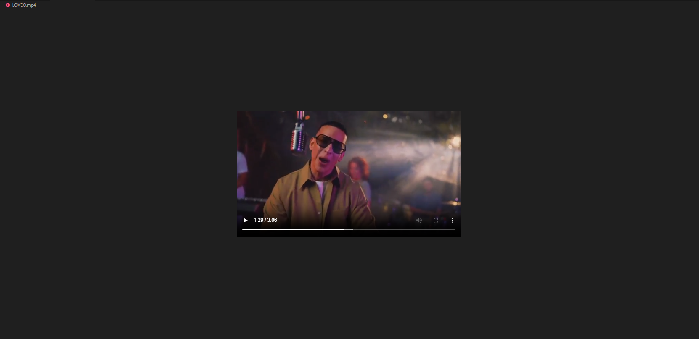

# YoutubeDownloader---Python

to run this application type in the terminal
 1) python install pytube
 2) python .\Downloader.py "https://www.youtube.com/watch?v=Im7zgLQS1eo"
 3) step 2 can be replaced with any youtube video link of your choice
if downloading straight to vscode you have to wait a bit for the video to download for it to render

